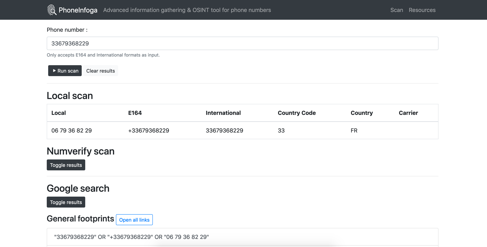

  

  
  
  
  
  

<h4 align="center">Advanced information gathering & OSINT framework for phone numbers</h4>

  <a href="https://sundowndev.github.io/PhoneInfoga/">Documentation</a> •
  <a href="https://petstore.swagger.io/?url=https://raw.githubusercontent.com/sundowndev/PhoneInfoga/master/api/docs/swagger.yaml">API documentation</a> •
  <a href="https://demo.phoneinfoga.crvx.fr/">Demo instance</a> •
  <a href="https://medium.com/@SundownDEV/phone-number-scanning-osint-recon-tool-6ad8f0cac27b">Related blog post</a>

## About

PhoneInfoga is one of the most advanced tools to scan international phone numbers using only free resources. It allows you to first gather standard information such as country, area, carrier and line type on any international phone number. Then search for footprints on search engines to try to find the VoIP provider or identify the owner.

## Unofficial video tutorials

## Current status

This project is stable and production-ready. [Roadmap is here](https://github.com/sundowndev/PhoneInfoga/projects/1).

**About demo instance**: This is a test service. Kittens will die if you abuse it. Numverify scan is pointless because my server's IP got blocked due to spam.

Since [v2 was released on March 2020](https://github.com/sundowndev/PhoneInfoga/releases/tag/v2.0-beta), this project has been rewritten in Go language (previously Python). Why ? To improve code base, maintainability, have a stronger test suite and be able to compile code base. PhoneInfoga v2 brings new features such as serving a REST API and a web client. Usage of scanners was improved in order to drop usage of Selenium/Geckodriver which has cause many users to have troubleshoots using the tool. You can still use the legacy version in [tag v1.11](https://github.com/sundowndev/PhoneInfoga/tree/v1.11) and the legacy Docker image (`sundowndev/phoneinfoga:legacy`). Some features were not included in version 2 such as input/output CLI options. The roadmap of the project changed so we can focus on the web client features. **Version 2 does not scan Google results anymore**, [read more](https://sundowndev.github.io/PhoneInfoga/usage/#available-scanners).

## Features

- Check if phone number exists and is possible
- Gather standard informations such as country, line type and carrier
- OSINT footprinting using external APIs, Google Hacking, phone books & search engines
- Check for reputation reports, social media, disposable numbers and more
- Scan several numbers at once
- Use custom formatting for more effective OSINT reconnaissance (*v1 only*)
- Use the graphical user interface to run scans from the browser
- Run your own web instance as a service
- Programmatic usage with the REST API

## Anti-features

- Does not claim to provide relevant or verified data, it's just a tool !
- Does not allow to "track" a phone or its owner in real time
- Does not allow to get the precise phone location
- Does not allow to hack a phone

## License

This tool is licensed under the GNU General Public License v3.0.

[Icon](https://www.flaticon.com/free-icon/fingerprint-search-symbol-of-secret-service-investigation_48838) made by <a href="https://www.freepik.com/" title="Freepik">Freepik</a> from <a href="https://www.flaticon.com/" title="Flaticon">flaticon.com</a> is licensed by <a href="http://creativecommons.org/licenses/by/3.0/" title="Creative Commons BY 3.0" target="_blank">CC 3.0 BY</a>.

## Support

Thanks to [JetBrains](https://www.jetbrains.com/?from=sundowndev) for supporting my open-source projects.
